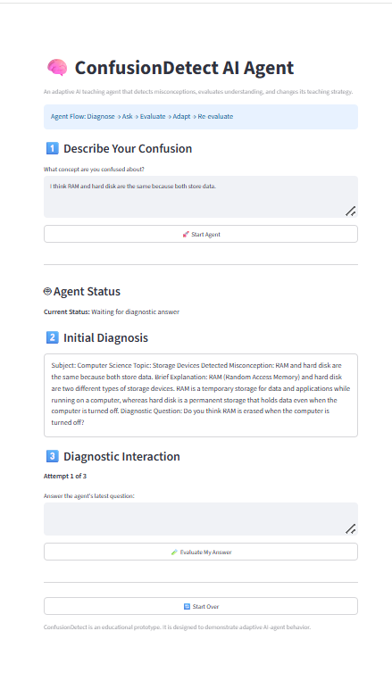
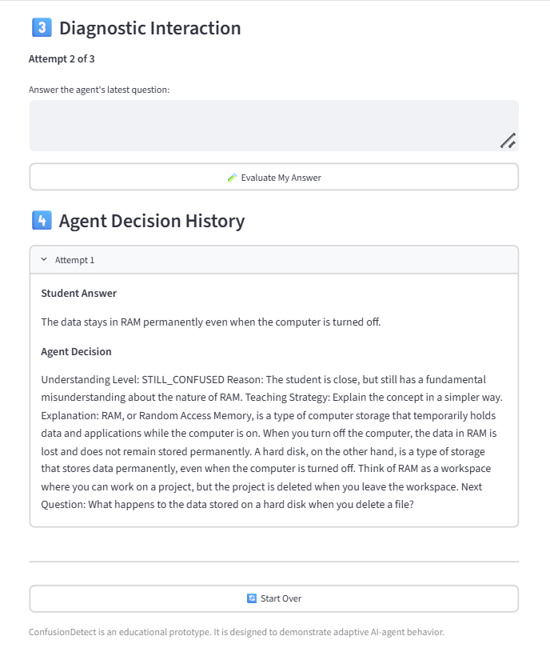

# 🧠 ConfusionDetect AI Agent

ConfusionDetect is an adaptive AI teaching agent that detects student misconceptions, evaluates understanding, and adapts its teaching strategy based on student responses.

## 🎯 Project Goal

The goal of ConfusionDetect is to help students correct misconceptions instead of simply providing direct answers.

The agent analyzes the student's input, detects the misconception, asks a diagnostic question, evaluates the student's response, and decides what teaching action should happen next.

## 🤖 Agent Workflow

**Student Input → Diagnose → Ask → Evaluate → Decide → Adapt → Re-evaluate**

The agent classifies student understanding into three states:

- **UNDERSTOOD** — The student demonstrates correct understanding.
- **PARTIALLY_UNDERSTOOD** — The student understands part of the concept but still has gaps.
- **STILL_CONFUSED** — The misconception is still present.

Based on this evaluation, the agent selects its next teaching action.

## ✨ Key Features

- Misconception detection
- Subject and topic identification
- Diagnostic question generation
- Student answer evaluation
- Adaptive teaching strategy
- Multi-step Agent Loop
- Attempt tracking and interaction history
- Local LLM execution
- No paid API required
- Streamlit user interface

## 🤖 Why Is This an AI Agent?

ConfusionDetect is more than a traditional question-answer chatbot.

It demonstrates:

- **Goal-oriented behavior** — Resolve the student's misconception.
- **Observation** — Analyze student statements and responses.
- **Reasoning** — Diagnose misconceptions and evaluate understanding.
- **Decision making** — Determine the student's understanding level.
- **Adaptive action** — Change the teaching strategy when needed.
- **State tracking** — Maintain attempts and interaction history.
- **Iterative behavior** — Continue evaluating and adapting until the learning goal is achieved.

## 🛠️ Technologies

- Python
- Streamlit
- Ollama
- Llama 3.2
- Local Large Language Model (LLM)

## 📁 Project Files

- `app.py` — Streamlit interface and Agent Loop
- `agent.py` — AI Agent reasoning and decision logic
- `tools.py` — Reserved for future agent tools
- `requirements.txt` — Python dependencies
- `.gitignore` — Files excluded from Git

## 💻 Installation

Clone the repository:

    git clone https://github.com/NoufAljabri-maker/ConfusionDetect-AI-Agent.git

Enter the project folder:

    cd ConfusionDetect-AI-Agent

Create a virtual environment:

    python -m venv venv

Activate it on Windows:

    venv\Scripts\activate.bat

Install dependencies:

    pip install -r requirements.txt

Download the local model:

    ollama pull llama3.2

Run the application:

    python -m streamlit run app.py

    ## 📸 Demo

The following screenshot shows ConfusionDetect analyzing a student's misconception and generating a diagnostic question.

---
### Adaptive Agent Decision

The agent evaluates the student's response, detects that the misconception is still present, changes its teaching strategy, and continues the learning loop.

## 🧪 Example

Student input:

> I think RAM and hard disk are the same because both store data.

The agent detects that the student is confusing temporary volatile memory with persistent storage.

It then asks a diagnostic question such as:

> What happens to the data stored in RAM when the computer is turned off?

If the student answers incorrectly, the agent can classify the response as **STILL_CONFUSED** and adapt its explanation.

When the student demonstrates correct understanding, the agent classifies the response as **UNDERSTOOD**.

## 🚀 Future Work

Future versions may include:

- Personalized learning profiles
- Long-term memory
- Retrieval-Augmented Generation (RAG)
- Subject-specific tools
- Teacher analytics
- Multi-agent collaboration

## 👩‍💻 Author

**Nouf Aljabri**

Computer Science